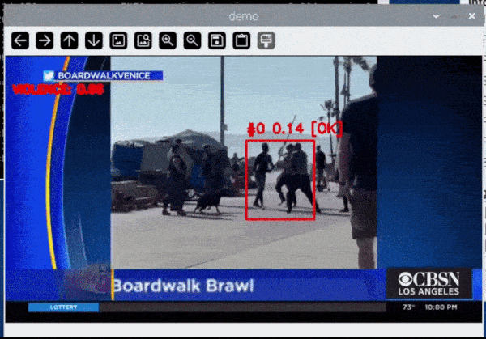
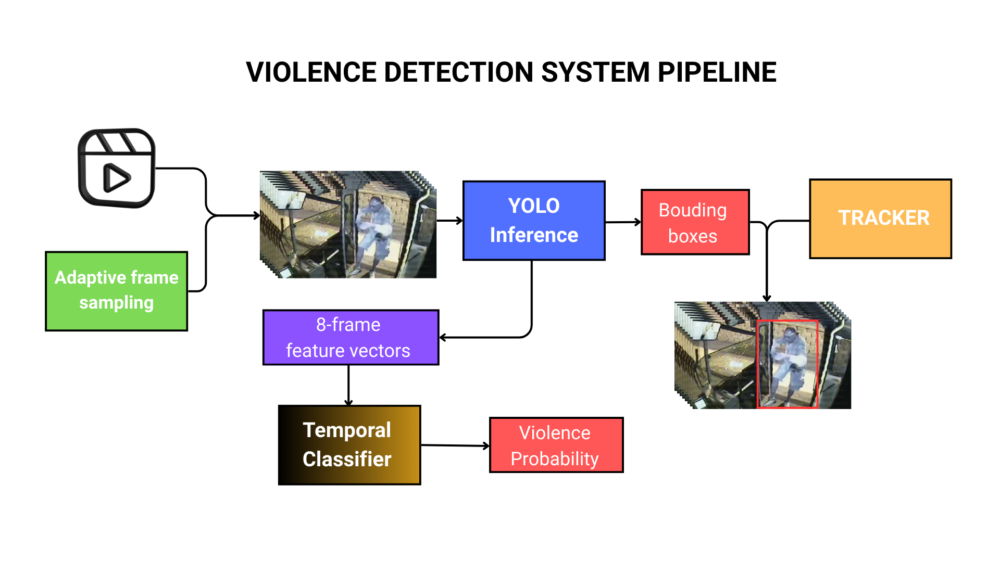
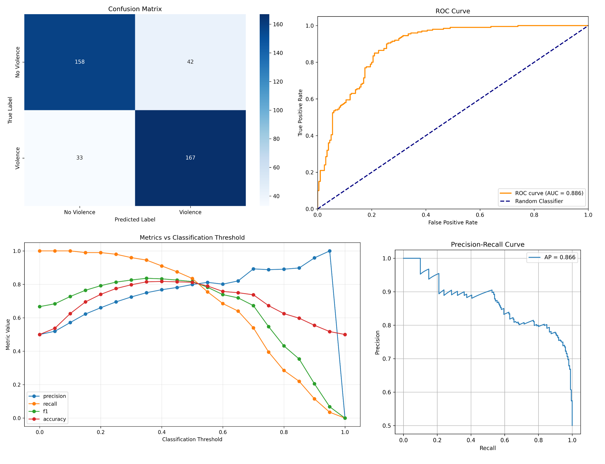
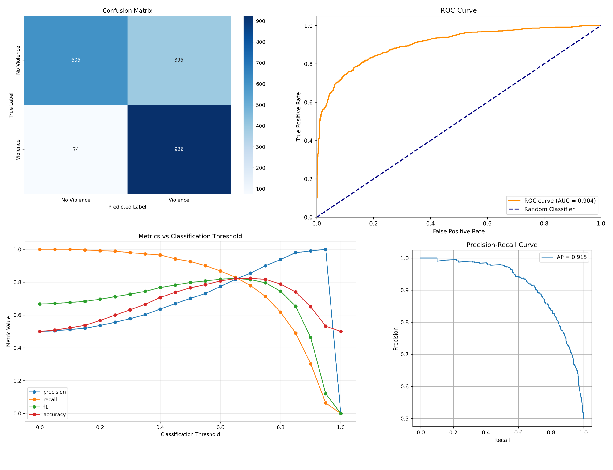
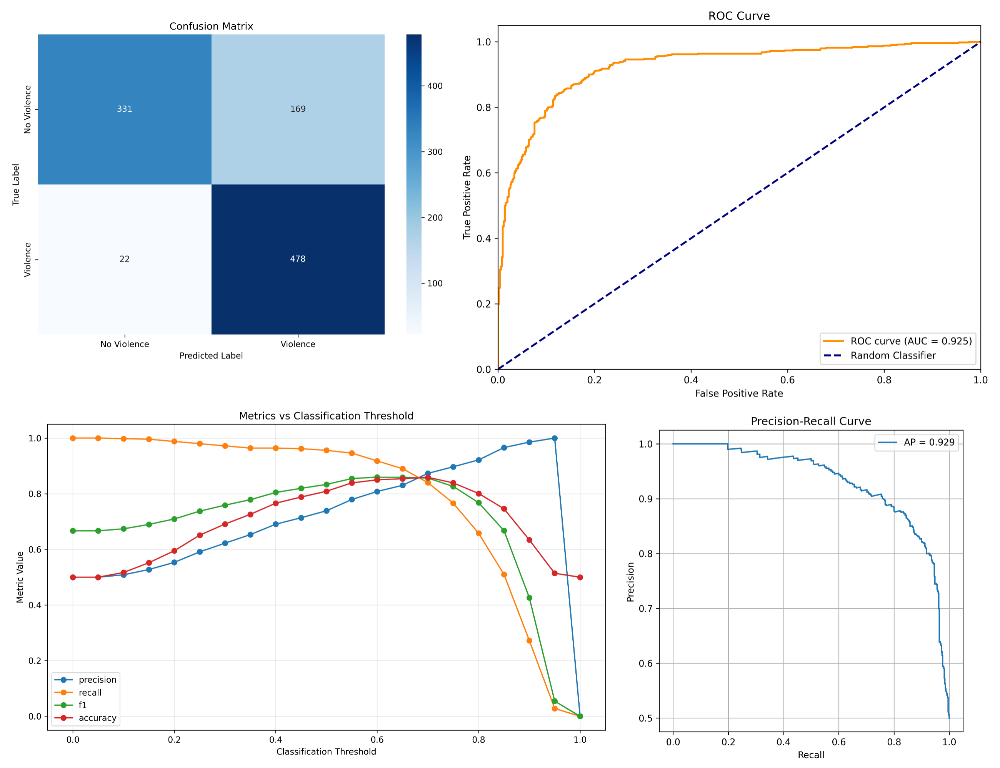
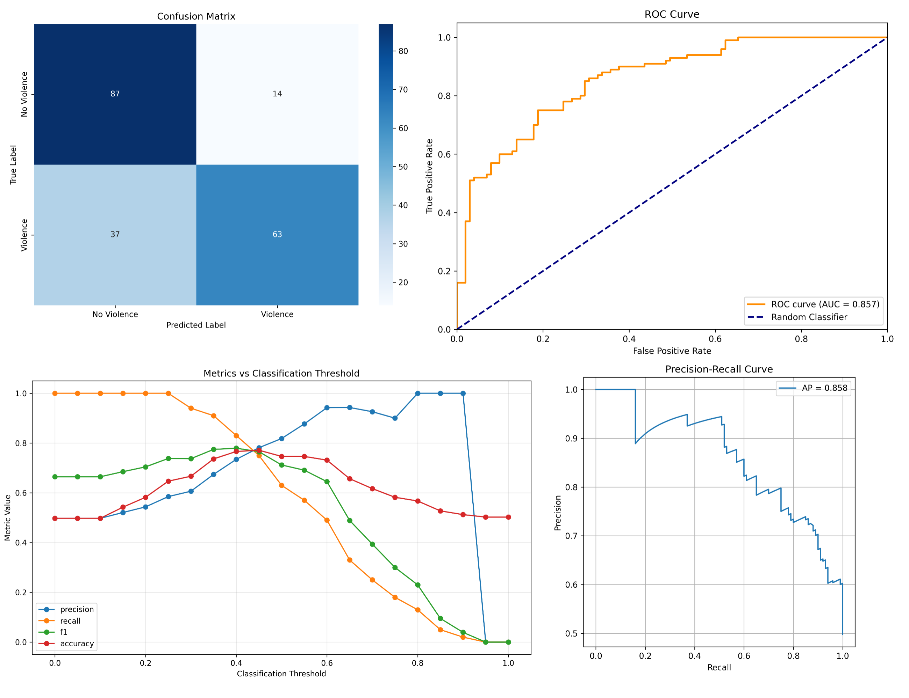

[English](README.md) | [Tiếng Việt](README_Vie.md)

Note: AI-assisted coding tools were used for minor implementation support

# Violence Detection System with YOLO26 + Temporal Classifier

Real-time violence detection using multi-object tracking and temporal classification. Detects and localizes violent behavior in video with bounding boxes and per-frame violence probability scores. Achieves 81% accuracy on RWF2000 and **50 FPS** on Raspberry Pi 5 with max frame time ~180ms

## Demo

Watch demo here: [https://youtu.be/Dp1zRq-7fus](https://youtu.be/Z1gKG_AFHuk)



## Overview



This project presents a lightweight violence detection system designed for real-time deployment on CPU-based edge devices.

The system combines spatial detection and temporal analysis:

• YOLO detects violence in video frames  
• A temporal classifier analyzes frame sequences to detect violent behavior

The goal is to achieve reliable violence detection while maintaining high inference speed on low-power hardware such as Raspberry Pi.

### Quick review

| Metric                        | Score   |
| ----------------------------- | ------- |
| **Accuracy**                  | ~75-85% |
| **ROC–AUC**                   | ~85-95% |
| **FPS(Raspberry Pi 5)**       | ~50 FPS |

## Features

- **Spatial Detection**: YOLO26 for real-time object detection and localization
- **Multi-Object Tracking**: Tracker with confidence-based hysteresis
- **Temporal Classification**: Temporal classifier on 8-frame feature sequences
- **Robust Tracking**: Automatic tracker failure recovery and confidence decay
- **Real-time Performance**: Optimized for CPU and GPU inference
- **Adaptive Frame Sampling**: Configurable detection intervals for resource efficiency

## Installation
```terminal

git clone https://github.com/NgMQuang/Lightweight-YOLO-based-real-time-violence-detection-on-CPU
cd Lightweight-YOLO-based-real-time-violence-detection-on-CPU

pip install -r requirements.txt
```

Download the weights and put inside ViolenceDetector folder

```terminal

cd ViolenceDetector
python ViolenceDetection.py

```

## Performance

**RWF2000(Val only)**



**Training metrics**

* Classifier

| Metric                        | Score  |
| ----------------------------- | ------ |
| **Accuracy**                  | 0.8125 |
| **Precision**                 | 0.7990 |
| **Recall**                    | 0.8350 |
| **F1 Score**                  | 0.8166 |
| **Specificity**               | 0.7900 |
| **False Positive Rate (FPR)** | 0.2100 |
| **False Negative Rate (FNR)** | 0.1650 |
| **ROC–AUC**                   | 0.8861 |

* Suspicious area localization

|Class     |Images|  Instances | Box(P    -      R    -  mAP50  -    mAP50-95)|
|----------|------|------------|----------------------------------------------|
|all       |3000  |    2865    |  0.712   -   0.704   -  0.754  -       0.425 |

## Testing

To evaluate generalization ability, the model was tested on
other datasets **WITHOUT TRAINING** on these datasets.

| Metric                        | RLVS   | HKF    | Movies |
| ----------------------------- | ------ | ------ | ------ |
| **Accuracy**                  | 0.7655 | 0.8090 | 0.7463 |
| **Precision**                 | 0.7010 | 0.7388 | 0.8182 |
| **Recall**                    | 0.9260 | 0.9560 | 0.6300 |
| **F1 Score**                  | 0.7979 | 0.6620 | 0.7119 |
| **Specificity**               | 0.6050 | 0.7900 | 0.8614 |
| **False Positive Rate (FPR)** | 0.3950 | 0.3380 | 0.1386 |
| **False Negative Rate (FNR)** | 0.0740 | 0.0440 | 0.3700 |
| **ROC–AUC**                   | 0.9037 | 0.9247 | 0.8574 |


**Real life violence Situation(Full)**



**HockeyFight(Full)**



**MovieFight(Full)**

   

Performance (Raspberry Pi 5 CPU)

Average FPS: 51.74

Pipeline timing:

|Task          | Average(ms) | Min(ms) | Max(ms) |
|--------------|-------------|---------|---------|
|Detection     | 10.426      | 0.000   | 165.764 |
|Tracking      | 2.118       | 0.000   | 14.342  |
|Classifier    | 0.542       | 0.000   | 15.600  |
|Visualization | 0.683       | 0.284   | 43.064  |
|Frame latency | 19.327      | 4.006   | 171.141 |

### Weights

https://drive.google.com/drive/folders/10E4KqX_fWGagm4lv79oJ9eFl63tIdKg7?usp=drive_link

### Configuration

```python
FPS_VIDEO = 30                   # Video frame rate, auto read when assign video path
TOTAL_TIME_DETECT = 2.5          # Detection window (seconds), DO NOT CHANGE
FRAME_PER_DETECT = 8             # Frames per classifier input, DO NOT CHANGE
DETECT_INTERVAL = 10             # The code implementation already compute it automatedly

TRACKER = "MEDIANFLOW"           # Tracker type, support MOSSE and KCF
MAX_TRACKS = 5                   # Max simultaneous tracks, DO NOT CHANGE
CONF_ON = 0.25                   # Show track threshold
CONF_OFF = 0.1                   # Hide track threshold
STICK_WEIGHT = 0.7               # Stickiness in scoring
alpha = 0.8                      # EMA smoothing factor
TRACKER_FAILURE_DECAY = 0.5      # Confidence decay on failure
```

## How It Works

### 1. Detection Phase (Every N frames)
- YOLO detects suspicious areas
- Returns bounding boxes with confidence scores
- Extracts feature vectors

### 2. Tracking Phase (Between detections)
- Tracker updates box positions frame-to-frame
- Confidence scores decay if tracker fails
- Boxes with low confidence are removed

### 3. Classification Phase (Every N frames)
- Collects last 8 feature vectors
- Passes to temporal classifier
- Outputs violence probability (0.0 - 1.0)
- Alerts if probability > 0.8

### 4. Hysteresis & Display
- Tracks shown/hidden based on confidence thresholds
- Color-coded bounding boxes with track IDs
- Violence probability displayed on frame

## Model Details

### YOLO26 (violence_yolo.onnx)
- **Input**: 256×320 RGB images (normalized 0-1)
- **Output**: 
  - Detections: (5, 6) - up to 5 boxes with [x1, y1, x2, y2, conf, class]
  - Features: (896, 15) - feature vector for temporal analysis
- **Inference Time**: ~50-200ms (CPU)

### Temporal Classifier (temporal_classifier.onnx + .onnx.data)
- **Input**: (8, 896, 15) - 8 consecutive feature vectors
- **Output**: (2) - logit for binary classification [0] for fight and [1] for nofight
- **Processing**: Conv1d x 3 !!! (Need an analysis here)
- **Inference Time**: ~1-5ms (CPU)

## Output

The script displays:
- **Bounding boxes** around detected people
- **Track IDs** and confidence scores
- **Tracker status** ("OK" or "HOLD")
- **Violence probability** when classified
- **Alert** when violence confidence > 0.8

## Dataset

Models trained on custom dataset derived from **RWF2000** (Real World Fighting Dataset):
- Contains real-world violence/non-violence scenarios
- Custom labeling
- 0.75 mAP on detection task
- 81.25% accuracy on violence classification

Dataset used for testing:
- Hockey Fight
- Movie Fight
- RLVS

## Future Work

- Improve spatial feature extraction
- Optimize for embedded deployment

## References

- YOLO26: https://github.com/ultralytics/ultralytics
- ONNX Runtime: https://onnxruntime.ai/
- RWF2000 Dataset: https://github.com/mchengny/RWF2000-Video-Database-for-Violence-Detection

## License

MIT License

## Acknowledgments

- YOLO26 by Ultralytics
- RWF2000 dataset creators
- ONNX Runtime community
- Hockey Fight
- Movie Fight
- RLVS

