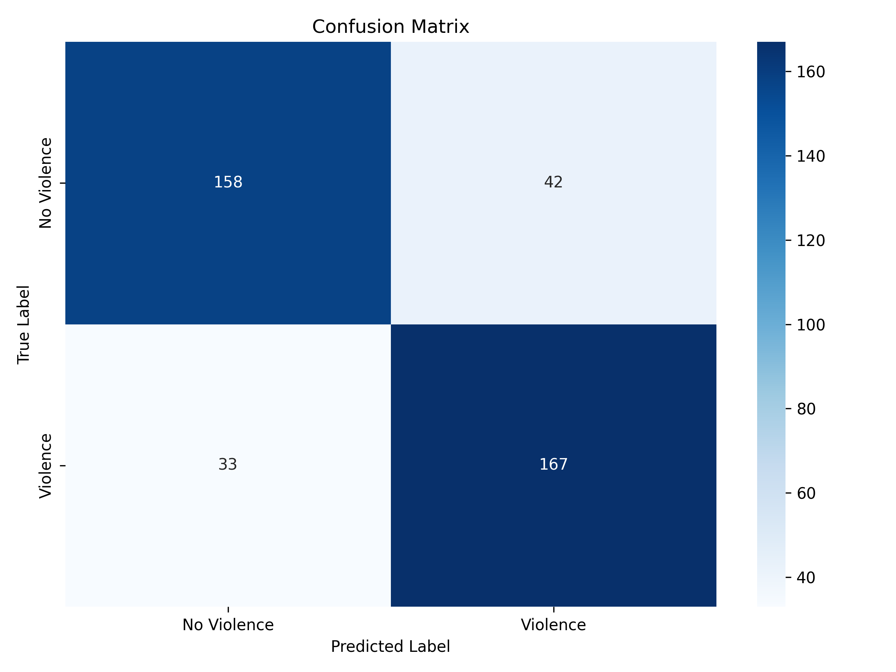
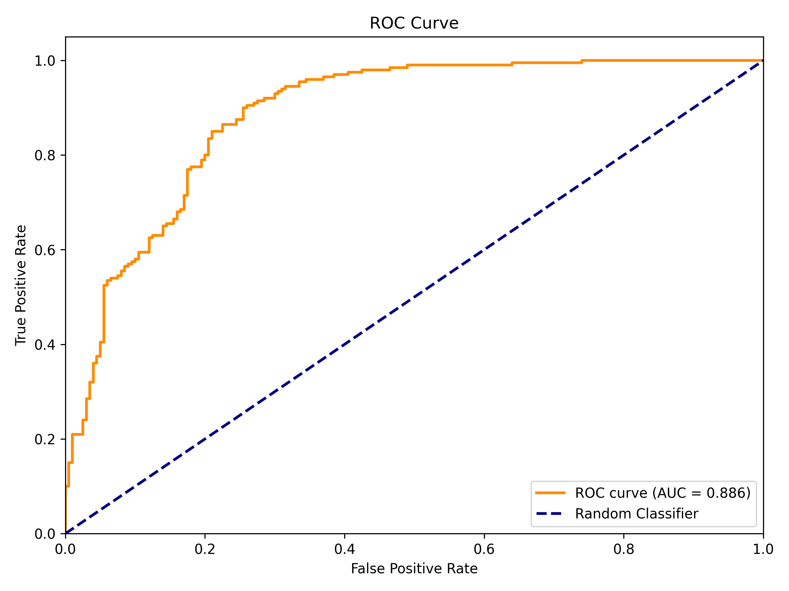
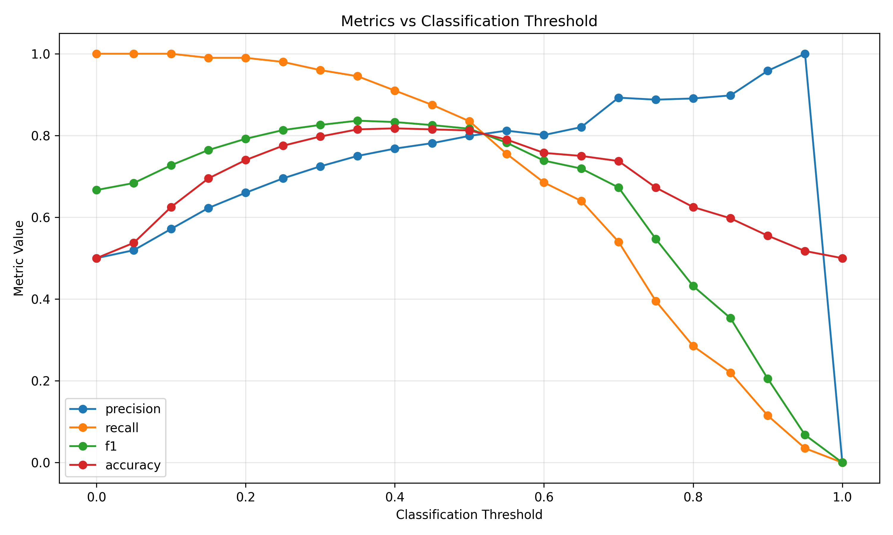
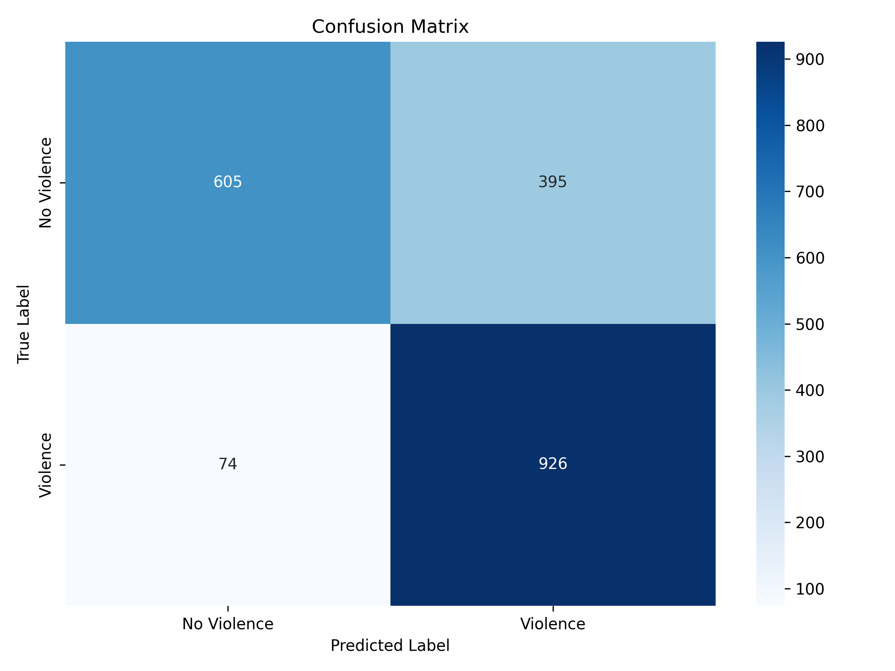
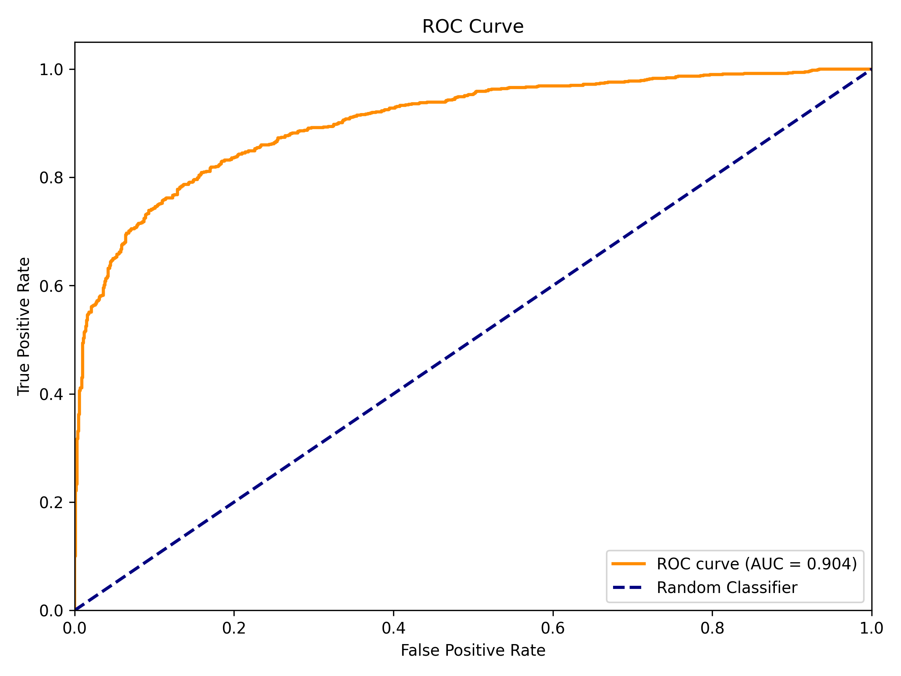
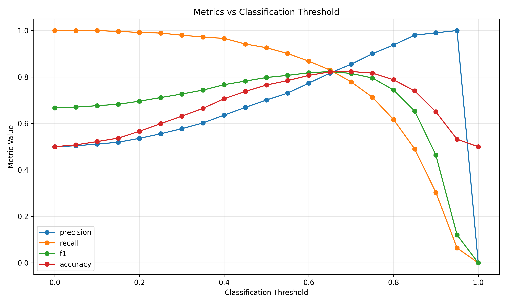

Note: AI-assisted coding tools were used for minor implementation support

# Violence Detection System with YOLO26 + Temporal Classifier

Real-time violence detection using multi-object tracking and temporal classification. Detects and localizes violent behavior in video with bounding boxes and per-frame violence probability scores.

## 🎯 Features

- **Spatial Detection**: YOLO26 for real-time object detection and localization
- **Multi-Object Tracking**: MOSSE tracker with confidence-based hysteresis
- **Temporal Classification**: Temporal classifier on 8-frame feature sequences
- **Robust Tracking**: Automatic tracker failure recovery and confidence decay
- **Real-time Performance**: Optimized for CPU and GPU inference
- **Adaptive Frame Sampling**: Configurable detection intervals for resource efficiency

## 📊 Performance

**RWF2000(Val only)**





**Training metrics**

* Classifier

## Model Evaluation Results

| Metric                        | Score  |
| ----------------------------- | ------ |
| **Accuracy**                  | 0.8125 |
| **Precision**                 | 0.7990 |
| **Recall**                    | 0.8350 |
| **F1 Score**                  | 0.8166 |
| **Specificity**               | 0.7900 |
| **False Positive Rate (FPR)** | 0.2100 |
| **False Negative Rate (FNR)** | 0.1650 |
| **ROC–AUC**                   | 0.8861 |

* Suspicious area localization

|Class     |Images|  Instances | Box(P    -      R    -  mAP50  -    mAP50-95)|
|----------|------|------------|----------------------------------------------|
|all       |3000  |    2865    |  0.712   -   0.704   -  0.754  -       0.425 |

**Testing**

To evaluate generalization ability, the model was tested on
other datasets **WITHOUT TRAINING** on these datasets.

**Real life violence Situation**





The model shows a strong capacity for detecting violent events, as reflected by consistently high recall across the evaluated datasets. This suggests that the system is capable of identifying most violent occurrences, supporting its potential applicability in real-world scenarios while maintaining an effective representation of violent activity patterns.

| Dataset     | ROC AUC |
| ----------- | ------- |
| RLVS        | 0.9037  |

## 🎞 Demo

Watch demo here: https://youtu.be/Dp1zRq-7fus

Performance (Raspberry Pi)

Average FPS: 47.3
Frame latency: 21 ms

Pipeline timing:
Detection:     14.5 ms
Tracking:       1.8 ms
Classifier:     0.15 ms
Visualization:  0.33 ms

!MAX DETECTION: 189ms

## 🏗️ Architecture

```
Video Frame
    ↓
[YOLO Detection] → Bounding boxes + Confidence
    ↓
[MOSSE Tracker] → Track objects across frames
    ↓
[Feature Extraction] → 512-dim feature vectors
    ↓
[GAPConv1D Classifier] → Violence probability (8-frame window)
    ↓
Output: Labeled frame with boxes + violence score
```

### Weights

https://drive.google.com/drive/folders/10E4KqX_fWGagm4lv79oJ9eFl63tIdKg7?usp=drive_link

### Configuration

```python
FPS_VIDEO = 30                   # Video frame rate, auto read when assign video path
TOTAL_TIME_DETECT = 2.5          # Detection window (seconds), DO NOT CHANGE
FRAME_PER_DETECT = 8             # Frames per classifier input, DO NOT CHANGE
DETECT_INTERVAL = 10             # The code implementation already compute it automatedly

TRACKER = "MOSSE"                # Tracker type, we found that MEDIANFLOW perform the most stability, but using MOSSE for fast demo
MAX_TRACKS = 5                   # Max simultaneous tracks, DO NOT CHANGE
CONF_ON = 0.25                   # Show track threshold
CONF_OFF = 0.1                   # Hide track threshold
STICK_WEIGHT = 0.7               # Stickiness in scoring
alpha = 0.8                      # EMA smoothing factor
TRACKER_FAILURE_DECAY = 0.5      # Confidence decay on failure
```

## 🔍 How It Works

### 1. Detection Phase (Every N frames)
- YOLO detects suspicious areas
- Returns bounding boxes with confidence scores
- Extracts 512-dimensional feature vectors

### 2. Tracking Phase (Between detections)
- Tracker(MOSSE) updates box positions frame-to-frame
- Confidence scores decay if tracker fails
- Boxes with low confidence are removed

### 3. Classification Phase (Every N frames)
- Collects last 8 feature vectors
- Passes to GAPConv1D temporal classifier
- Outputs violence probability (0.0 - 1.0)
- Alerts if probability > 0.8

### 4. Hysteresis & Display
- Tracks shown/hidden based on confidence thresholds
- Color-coded bounding boxes with track IDs
- Violence probability displayed on frame

## 📊 Model Details

### YOLO26 (violence_yolo.onnx)
- **Input**: 320×320 RGB images (normalized 0-1)
- **Output**: 
  - Detections: (5, 6) - up to 5 boxes with [x1, y1, x2, y2, conf, class]
  - Features: (512,) - feature vector for temporal analysis
- **Inference Time**: ~50-100ms (CPU)

### GAPConv1D (gapconv1d.onnx)
- **Input**: (8, 512) - 8 consecutive feature vectors
- **Output**: (1,) - logit for binary classification
- **Processing**: Global Average Pooling + Conv1D
- **Inference Time**: ~5-10ms (CPU)

## 🎮 Output

The script displays:
- **Bounding boxes** around detected people
- **Track IDs** and confidence scores
- **Tracker status** ("OK" or "HOLD")
- **Violence probability** when classified
- **Alert** when violence confidence > 0.8

## 🔬 Dataset

Models trained on custom dataset derived from **RWF2000** (Real World Fighting Dataset):
- Contains real-world violence/non-violence scenarios
- Custom labeling
- 0.75 mAP on detection task
- 82.63% accuracy on violence classification

Dataset used for testing:
- Hockey Fight
- Movie Fight
- RLVS

## 📚 References

- YOLO26: https://github.com/ultralytics/ultralytics
- ONNX Runtime: https://onnxruntime.ai/
- RWF2000 Dataset: https://github.com/mchengny/RWF2000-Video-Database-for-Violence-Detection

## 📄 License

MIT

## 🙏 Acknowledgments

- YOLO26 by Ultralytics
- RWF2000 dataset creators
- ONNX Runtime community
- Hockey Fight
- Movie Fight
- RLVS

