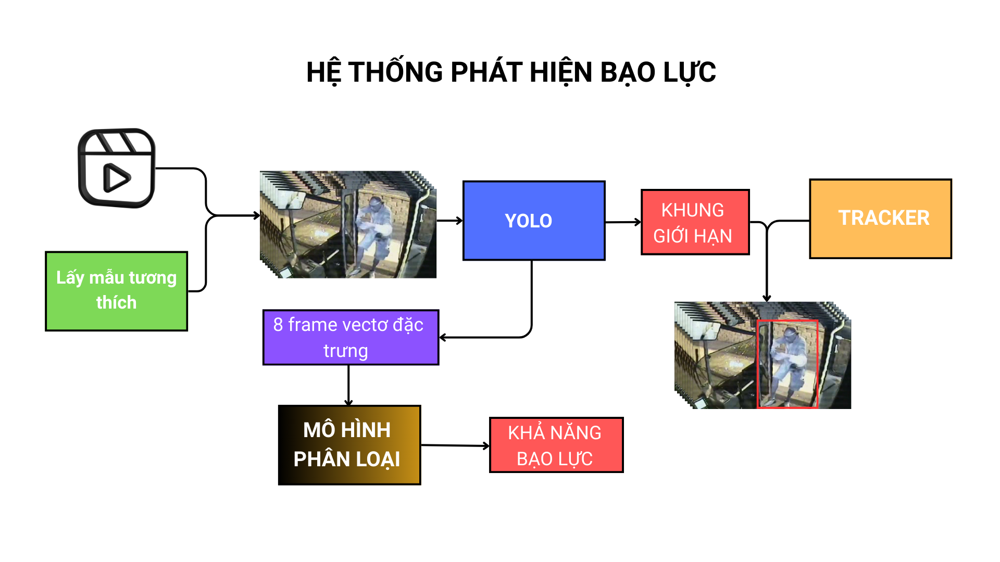

<div align="center">

[English](README.md) | [Tiếng Việt](README_Vie.md)

</div>

Lưu ý: Các công cụ lập trình AI đã được sử dụng để hỗ trợ một phần nhỏ trong quá trình triển khai.

## Hệ thống phát hiện bạo lực với YOLO26 + Bộ phân loại theo thời gian

Real-time violence detection on edge devices

- 50 FPS trên Raspberry Pi 5
- Độ chính xác 81% trên RWF2000
- 0.88 ROC-AUC
- Đánh giá trên nhiều tập dữ liệu khác nhau (RLVS / Hockey / Movies)

## Demo

Xem demo tại đây: [https://youtu.be/Z1gKG_AFHuk](https://youtu.be/Z1gKG_AFHuk)


## Tổng quan



Dự án là một mô hình AI có khả năng phát hiện bạo lực theo thời gian thực và thực thi trên các thiết bị biên chỉ sử dụng CPU

Hệ thông bao gồm việc định vị hành vi bạo lực trong ảnh và phân loại hành vi bạo lực và không bạo lực:

- Mô hình YOLO được sử dụng cho việc xác định khu vực diễn ra hành vi bạo lực
- Mô hình phân loại hành vi bạo lực dựa trên phân tích chuỗi các khung hình 

Mục tiêu của dự án là phát triển mô hình bạo lực đáng tin cậy và hiệu quả trên các phần cứng hạn chế tài nguyên như Raspberry Pi 5

### Tóm tắt

| Thang đo                      | Thông số   |
| ----------------------------- | ---------- |
| **Accuracy**                  | 81.25%     |
| **ROC–AUC**                   | 0.886      |
| **FPS(Raspberry Pi 5)**       | 51 FPS     |


### Tính năng

- **Phát hiện không gian (Spatial Detection)**: YOLO26 cho phép phát hiện và định vị đối tượng theo thời gian thực
- **Theo dõi đa đối tượng (Multi-Object Tracking)**: Bộ theo dõi độ trễ dựa trên độ tin cậy (confidence-based hysteresis)
- **Phân loại theo thời gian (Temporal Classification)**: Bộ phân loại theo chuỗi thời gian trên chuỗi 8 khung hình đặc trưng (feature sequences)
- **Theo dõi ổn định**: Tự động khôi phục khi bộ theo dõi thất bại và suy giảm độ tin cậy theo thời gian
- **Hiệu năng thời gian thực**: Tối ưu cho suy luận trên CPU và GPU
- **Lấy mẫu khung hình tương thích**: Cấu hình được khoảng cách giữa các lần phát hiện để tiết kiệm tài nguyên

## Cài đặt

```terminal
git clone https://github.com/NgMQuang/Lightweight-YOLO-based-real-time-violence-detection-on-CPU
cd Lightweight-YOLO-based-real-time-violence-detection-on-CPU

pip install -r requirements.txt
```

Tải các trọng số (weights) và sắp xếp như dưới:

```text
ViolenceDetector/
├── violence_yolo.onnx
├── temporal_classifier.onnx
├── temporal_classifier.onnx.data
└── demo.mp4
```
 
Xin vui lòng chuẩn bị trước một video demo.mp4

```terminal
cd ViolenceDetector
python ViolenceDetection.py
```

### Hiệu năng

## Huấn luyện và đánh giá

**RWF2000 (chỉ tập Val)**


**Chỉ số huấn luyện**

- **Bộ phân loại**

| Chỉ số                        | Giá trị |
| ----------------------------- | ------- |
| **Accuracy (Độ chính xác)**   | 0.8125  |
| **Precision (Độ chính xác dương)** | 0.7990  |
| **Recall (Độ bao phủ)**      | 0.8350  |
| **F1 Score**                 | 0.8166  |
| **Specificity (Độ đặc hiệu)** | 0.7900 |
| **False Positive Rate (FPR)** | 0.2100 |
| **False Negative Rate (FNR)** | 0.1650 |
| **ROC–AUC**                  | 0.8861  |

- **Khoanh vùng khu vực đáng ngờ**

|Lớp      |Ảnh  |  Số mẫu  | Box(P    -      R    -  mAP50  -    mAP50-95)|
|---------|-----|----------|----------------------------------------------|
|all      |3000 |   2865   |  0.712   -   0.704   -  0.754  -       0.425 |

### Kiểm thử

Để đánh giá khả năng khái quát hóa, mô hình được kiểm thử trên
các bộ dữ liệu mà **KHÔNG ĐƯỢC HUẤN LUYỆN TRÊN ĐÓ'

| Thang đo                      | RLVS   | HKF    | Movies |
| ----------------------------- | ------ | ------ | ------ |
| **Accuracy**                  | 0.7655 | 0.8090 | 0.7463 |
| **Precision**                 | 0.7010 | 0.7388 | 0.8182 |
| **Recall**                    | 0.9260 | 0.9560 | 0.6300 |
| **F1 Score**                  | 0.7979 | 0.6620 | 0.7119 |
| **Specificity**               | 0.6050 | 0.7900 | 0.8614 |
| **False Positive Rate (FPR)** | 0.3950 | 0.3380 | 0.1386 |
| **False Negative Rate (FNR)** | 0.0740 | 0.0440 | 0.3700 |
| **ROC–AUC**                   | 0.9037 | 0.9247 | 0.8574 |

**Real Life Violence Situation (Toàn bộ)**


**HockeyFight (Toàn bộ)**


**MovieFight (Toàn bộ)**

   

## Hiện thực trên Raspberry Pi 5

FPS trung bình: 51.74

Thời gian chạy hệ thống:

|Nhiệm vụ      | Trung bình(ms) | Ngắn nhất(ms) | Dài nhất(ms) |
|--------------|----------------|---------------|--------------|
|Phát hiện     | 10.426         | 0.000         | 165.764      |
|Theo dõi      | 2.118          | 0.000         | 14.342       |
|Phân loại     | 0.542          | 0.000         | 15.600       |
|Hiển thị      | 0.683          | 0.284         | 43.064       |
|Tổng thể      | 19.327         | 4.006         | 171.141      |

### Trọng số (Weights)

Liên kết tải trọng số mô hình:

https://drive.google.com/drive/folders/10E4KqX_fWGagm4lv79oJ9eFl63tIdKg7?usp=drive_link

Hoặc có thể tìm kiếm trong releases

### Cấu hình

```python
FPS_VIDEO = 30                   # Tốc độ khung hình video, tự đọc khi gán đường dẫn video
TOTAL_TIME_DETECT = 2.5          # Cửa sổ phát hiện (giây), KHÔNG THAY ĐỔI
FRAME_PER_DETECT = 8             # Số khung cho mỗi lần phân loại, KHÔNG THAY ĐỔI
DETECT_INTERVAL = 10             # Code đã tự động tính toán khoảng cách này

TRACKER = "MEDIANFLOW"           # Loại tracker, hỗ trợ MOSSE và KCF
MAX_TRACKS = 5                   # Số luồng theo dõi tối đa, KHÔNG THAY ĐỔI
CONF_ON = 0.25                   # Ngưỡng hiển thị track
CONF_OFF = 0.1                   # Ngưỡng ẩn track
STICK_WEIGHT = 0.7               # Độ "dính" trong việc tính điểm
alpha = 0.8                      # Hệ số làm mượt EMA
TRACKER_FAILURE_DECAY = 0.5      # Tốc độ suy giảm độ tin cậy khi tracker thất bại
```

### 🔍 Cách hoạt động

#### 1. Giai đoạn phát hiện (mỗi N khung)

- YOLO phát hiện các khu vực đáng ngờ
- Trả về các khung giới hạn kèm điểm độ tin cậy
- Trích xuất các vector đặc trưng

#### 2. Giai đoạn theo dõi (giữa các lần phát hiện)

- Tracker cập nhật vị trí hộp theo từng khung hình
- Độ tin cậy suy giảm nếu tracker thất bại
- Các hộp có độ tin cậy thấp sẽ bị loại bỏ

#### 3. Giai đoạn phân loại (mỗi N khung)

- Thu thập 8 vector đặc trưng gần nhất
- Đưa vào bộ phân loại theo thời gian
- Xuất ra xác suất bạo lực (0.0 - 1.0)
- Cảnh báo nếu xác suất > 0.8

#### 4. Hysteresis(Khoảng đệm) & Hiển thị

- Track được hiển thị/ẩn dựa trên ngưỡng độ tin cậy
- Hộp giới hạn được tô màu kèm theo ID track
- Xác suất bạo lực được hiển thị trên khung hình

### 📊 Chi tiết mô hình

#### YOLO26 (`violence_yolo.onnx`)

- **Input**: Ảnh RGB 256×320 (chuẩn hóa 0-1)
- **Output**: 
  - Detections: (5, 6) - tối đa 5 hộp với [x1, y1, x2, y2, conf, class]
  - Features: (896, 15) - vector đặc trưng phục vụ phân tích theo thời gian
- **Thời gian suy luận**: ~50–200ms (CPU)

#### Bộ phân loại theo thời gian (`temporal_classifier.onnx` + `.onnx.data`)

- **Input**: (8, 896, 15) - 8 vector đặc trưng liên tiếp
- **Output**: (2) - logit cho bài toán phân lớp nhị phân: [1] là "fight", [0] là "nofight"
- **Thời gian suy luận**: ~1–5ms (CPU)

### Đầu ra

Script sẽ hiển thị:

- **Các khung giới hạn (bounding boxes)** bao quanh người được theo dõi
- **ID track** và độ tin cậy
- **Trạng thái theo dõi** ("OK" hoặc "HOLD")
- **Xác suất bạo lực** khi được phân loại
- **Cảnh báo** khi độ tin cậy bạo lực > 0.8

### Bộ dữ liệu

Các mô hình được huấn luyện trên bộ dữ liệu tùy chỉnh dựa trên **RWF2000** (Real World Fighting Dataset):

- Chứa các tình huống bạo lực/không bạo lực trong thế giới thực
- Gán nhãn tùy chỉnh
- Đạt 0.75 mAP ở bài toán phát hiện
- 81.25% độ chính xác ở bài toán phân loại bạo lực

Bộ dữ liệu dùng để kiểm thử:

- Hockey Fight
- Movie Fight
- RLVS

## Hướng phát triển

- Cải thiện trích xuất đặc trưng không gian
- Tối ưu thêm cho các hệ thống nhúng

### Tài liệu tham khảo

- YOLO26: `https://github.com/ultralytics/ultralytics`
- ONNX Runtime: `https://onnxruntime.ai/`
- Bộ dữ liệu RWF2000: `https://github.com/mchengny/RWF2000-Video-Database-for-Violence-Detection`

### 📄 Giấy phép

MIT License

### Lời cảm ơn

- YOLO26 bởi Ultralytics
- Nhóm xây dựng bộ dữ liệu RWF2000
- Cộng đồng ONNX Runtime
- Hockey Fight
- Movie Fight
- RLVS


