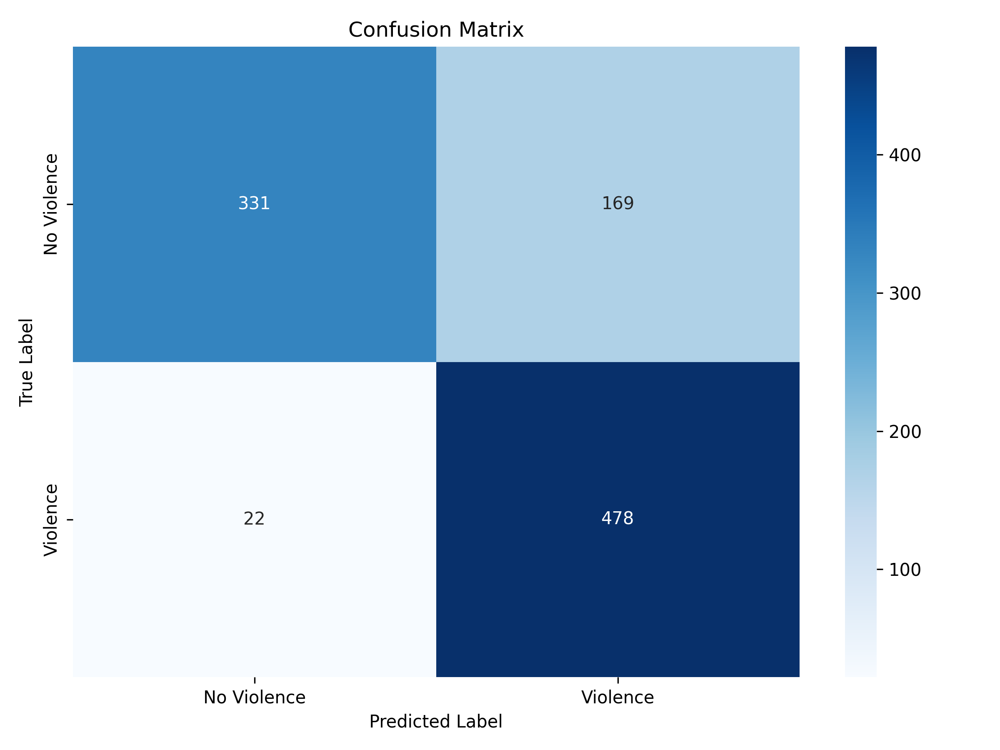
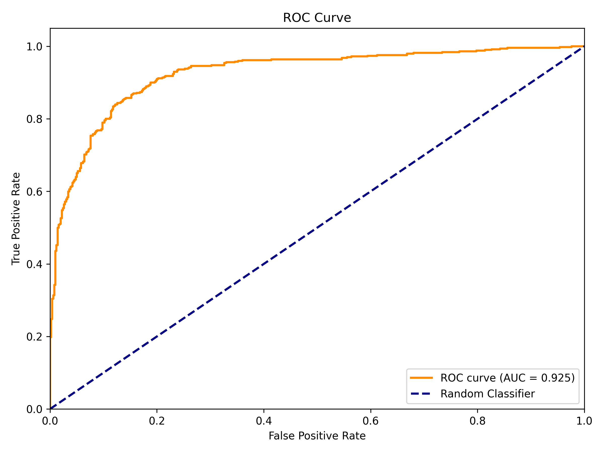
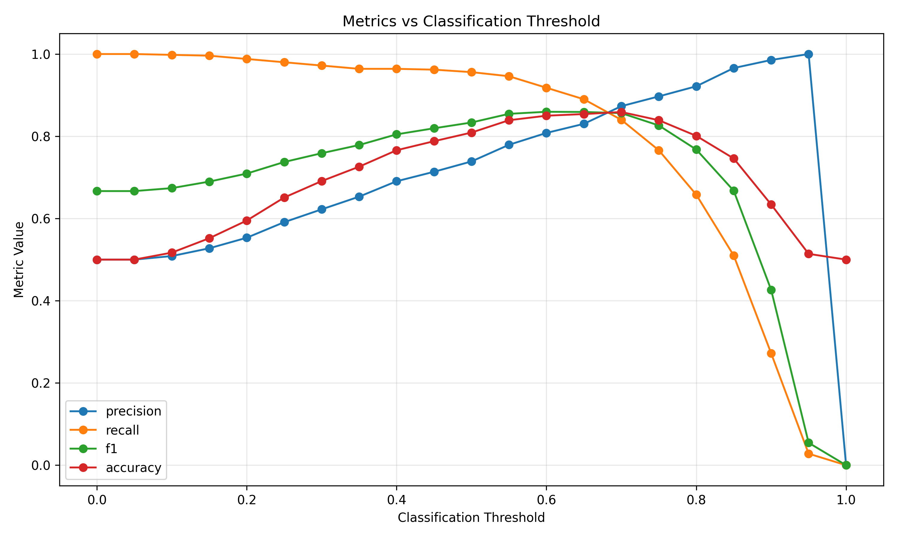
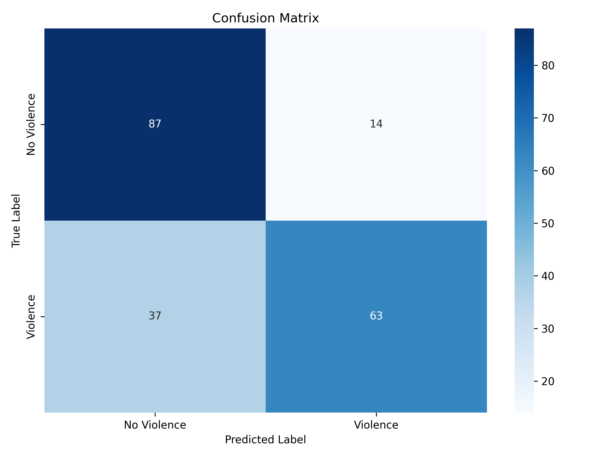
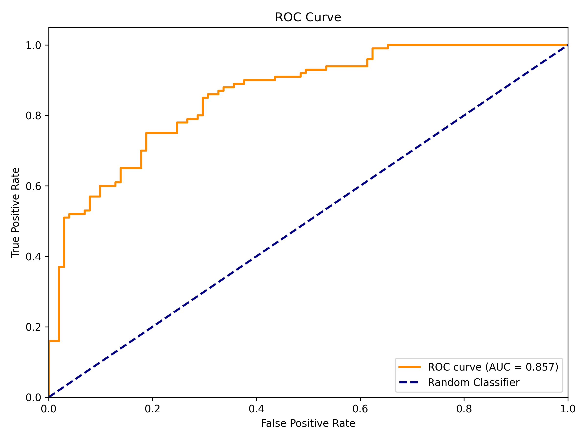
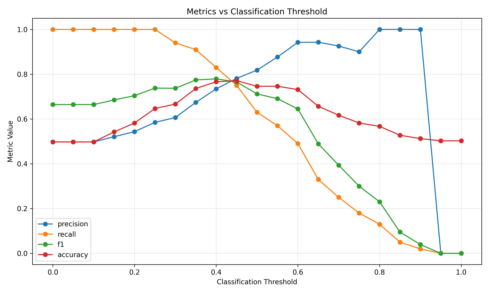

Lưu ý: Các công cụ lập trình hỗ trợ bởi AI đã được sử dụng để hỗ trợ một phần nhỏ trong quá trình triển khai.

## Hệ thống phát hiện bạo lực với YOLO26 + Bộ phân loại theo thời gian

Phát hiện bạo lực thời gian thực bằng cách kết hợp theo dõi nhiều đối tượng và phân loại theo chuỗi thời gian. Hệ thống phát hiện và khoanh vùng hành vi bạo lực trong video với các khung giới hạn và tỉ lệ xác suất bạo lực cho từng khung hình.

### 🎯 Tính năng

- **Phát hiện không gian (Spatial Detection)**: YOLO26 cho phép phát hiện và định vị đối tượng theo thời gian thực
- **Theo dõi đa đối tượng (Multi-Object Tracking)**: Bộ theo dõi độ trễ dựa trên độ tin cậy (confidence-based hysteresis)
- **Phân loại theo thời gian (Temporal Classification)**: Bộ phân loại theo chuỗi thời gian trên chuỗi 8 khung hình đặc trưng (feature sequences)
- **Theo dõi ổn định**: Tự động khôi phục khi bộ theo dõi thất bại và suy giảm độ tin cậy theo thời gian
- **Hiệu năng thời gian thực**: Tối ưu cho suy luận trên CPU và GPU
- **Lấy mẫu khung hình tương thích**: Cấu hình được khoảng cách giữa các lần phát hiện để tiết kiệm tài nguyên

### 📊 Hiệu năng

**RWF2000 (chỉ tập Val)**


**Chỉ số huấn luyện**

- **Bộ phân loại**

| Chỉ số                        | Giá trị |
| ----------------------------- | ------- |
| **Accuracy (Độ chính xác)**  | 0.8125  |
| **Precision (Độ chính xác dương)** | 0.7990  |
| **Recall (Độ bao phủ)**      | 0.8350  |
| **F1 Score**                 | 0.8166  |
| **Specificity (Độ đặc hiệu)** | 0.7900 |
| **False Positive Rate (FPR)** | 0.2100 |
| **False Negative Rate (FNR)** | 0.1650 |
| **ROC–AUC**                  | 0.8861  |

- **Khoanh vùng khu vực đáng ngờ**

|Lớp      |Ảnh  |  Số mẫu  | Box(P    -      R    -  mAP50  -    mAP50-95)|
|---------|-----|----------|----------------------------------------------|
|all      |3000 |   2865   |  0.712   -   0.704   -  0.754  -       0.425 |

### Kiểm thử

Để đánh giá khả năng khái quát hóa, mô hình được kiểm thử trên
các bộ dữ liệu **KHÔNG ĐƯỢC HUẤN LUYỆN** trước đó.

**Real Life Violence Situation (Toàn bộ)**


| Chỉ số                        | Giá trị |
| ----------------------------- | ------- |
| **Accuracy (Độ chính xác)**  | 0.7655  |
| **Precision (Độ chính xác dương)** | 0.7010  |
| **Recall (Độ bao phủ)**      | 0.9260  |
| **F1 Score**                 | 0.7979  |
| **Specificity (Độ đặc hiệu)** | 0.6050 |
| **False Positive Rate (FPR)** | 0.3950 |
| **False Negative Rate (FNR)** | 0.0740 |
| **ROC–AUC**                  | 0.9037  |

**HockeyFight (Toàn bộ)**





| Chỉ số                        | Giá trị |
| ----------------------------- | ------- |
| **Accuracy (Độ chính xác)**  | 0.8090  |
| **Precision (Độ chính xác dương)** | 0.7388  |
| **Recall (Độ bao phủ)**      | 0.9560  |
| **F1 Score**                 | 0.6620  |
| **Specificity (Độ đặc hiệu)** | 0.7900 |
| **False Positive Rate (FPR)** | 0.3380 |
| **False Negative Rate (FNR)** | 0.0440 |
| **ROC–AUC**                  | 0.9247  |  

**MovieFight (Toàn bộ)**





| Chỉ số                                | Giá trị |
| -----------------------------         | ------- |
| **Accuracy (Độ chính xác)**           | 0.7463  |
| **Precision (Độ chính xác dương)**    | 0.8182  |
| **Recall (Độ bao phủ)**               | 0.6300  |
| **F1 Score**                          | 0.7119  |
| **Specificity (Độ đặc hiệu)**         | 0.8614  |
| **False Positive Rate (FPR)**         | 0.1386  |
| **False Negative Rate (FNR)**         | 0.3700  |
| **ROC–AUC**                           | 0.8574  |  

### 🎞 Demo

Xem video demo tại: [`https://youtu.be/Dp1zRq-7fus`](https://youtu.be/Z1gKG_AFHuk)

Hiệu năng (Raspberry Pi)

- FPS trung bình: 47.3
- Độ trễ mỗi khung hình: 21 ms

Thời gian cho từng bước trong pipeline:

- Phát hiện (Detection):     14.5 ms
- Theo dõi (Tracking):       1.8 ms
- Phân loại (Classifier):    0.15 ms
- Hiển thị (Visualization):  0.33 ms

!THỜI GIAN PHÁT HIỆN LỚN NHẤT: 189ms

### 🏗️ Kiến trúc

```text
Khung hình video
    ↓
[YOLO Detection] → Hộp giới hạn + Độ tin cậy -> [Tracker] → Theo dõi đối tượng qua các khung hình
    ↓
[Trích xuất đặc trưng không gian] → vector đặc trưng kích thước 896 × 15
    ↓
[Bộ phân loại theo thời gian] → Xác suất bạo lực (cửa sổ 8 khung hình)
    ↓
Đầu ra: Khung hình được gắn nhãn với hộp và điểm bạo lực
```

### Trọng số (Weights)

Liên kết tải trọng số mô hình:
`https://drive.google.com/drive/folders/10E4KqX_fWGagm4lv79oJ9eFl63tIdKg7?usp=drive_link`

### Cấu hình

```python
FPS_VIDEO = 30                   # Tốc độ khung hình video, tự đọc khi gán đường dẫn video
TOTAL_TIME_DETECT = 2.5          # Cửa sổ phát hiện (giây), KHÔNG THAY ĐỔI
FRAME_PER_DETECT = 8             # Số khung cho mỗi lần phân loại, KHÔNG THAY ĐỔI
DETECT_INTERVAL = 10             # Code đã tự động tính toán khoảng cách này

TRACKER = "MEDIANFLOW"           # Loại tracker, hỗ trợ MOSSE và KCF
MAX_TRACKS = 5                   # Số luồng theo dõi tối đa, KHÔNG THAY ĐỔI
CONF_ON = 0.25                   # Ngưỡng hiển thị track
CONF_OFF = 0.1                   # Ngưỡng ẩn track
STICK_WEIGHT = 0.7               # Độ "dính" trong việc tính điểm
alpha = 0.8                      # Hệ số làm mượt EMA
TRACKER_FAILURE_DECAY = 0.5      # Tốc độ suy giảm độ tin cậy khi tracker thất bại
```

### 🔍 Cách hoạt động

#### 1. Giai đoạn phát hiện (mỗi N khung)

- YOLO phát hiện các khu vực đáng ngờ
- Trả về các khung giới hạn kèm điểm độ tin cậy
- Trích xuất các vector đặc trưng

#### 2. Giai đoạn theo dõi (giữa các lần phát hiện)

- Tracker cập nhật vị trí hộp theo từng khung hình
- Độ tin cậy suy giảm nếu tracker thất bại
- Các hộp có độ tin cậy thấp sẽ bị loại bỏ

#### 3. Giai đoạn phân loại (mỗi N khung)

- Thu thập 8 vector đặc trưng gần nhất
- Đưa vào bộ phân loại theo thời gian
- Xuất ra xác suất bạo lực (0.0 - 1.0)
- Cảnh báo nếu xác suất > 0.8

#### 4. Hysteresis(Khoảng đệm) & Hiển thị

- Track được hiển thị/ẩn dựa trên ngưỡng độ tin cậy
- Hộp giới hạn được tô màu kèm theo ID track
- Xác suất bạo lực được hiển thị trên khung hình

### 📊 Chi tiết mô hình

#### YOLO26 (`violence_yolo.onnx`)

- **Input**: Ảnh RGB 256×320 (chuẩn hóa 0-1)
- **Output**: 
  - Detections: (5, 6) - tối đa 5 hộp với [x1, y1, x2, y2, conf, class]
  - Features: (896, 15) - vector đặc trưng phục vụ phân tích theo thời gian
- **Thời gian suy luận**: ~50–200ms (CPU)

#### Bộ phân loại theo thời gian (`temporal_classifier.onnx` + `.onnx.data`)

- **Input**: (8, 896, 15) - 8 vector đặc trưng liên tiếp
- **Output**: (2) - logit cho bài toán phân lớp nhị phân: [0] là "fight", [1] là "nofight"
- **Xử lý**: 3 lớp mạng tích chập 1 chiều liên tiếp (cần phân tích chi tiết thêm)
- **Thời gian suy luận**: ~1–5ms (CPU)

### 🎮 Đầu ra

Script sẽ hiển thị:

- **Các khung giới hạn (bounding boxes)** bao quanh người được theo dõi
- **ID track** và độ tin cậy
- **Trạng thái theo dõi** ("OK" hoặc "HOLD")
- **Xác suất bạo lực** khi được phân loại
- **Cảnh báo** khi độ tin cậy bạo lực > 0.8

### 🔬 Bộ dữ liệu

Các mô hình được huấn luyện trên bộ dữ liệu tùy chỉnh dựa trên **RWF2000** (Real World Fighting Dataset):

- Chứa các tình huống bạo lực/không bạo lực trong thế giới thực
- Gán nhãn tùy chỉnh
- Đạt 0.75 mAP ở bài toán phát hiện
- 82.63% độ chính xác ở bài toán phân loại bạo lực

Bộ dữ liệu dùng để kiểm thử:

- Hockey Fight
- Movie Fight
- RLVS

### 📚 Tài liệu tham khảo

- YOLO26: `https://github.com/ultralytics/ultralytics`
- ONNX Runtime: `https://onnxruntime.ai/`
- Bộ dữ liệu RWF2000: `https://github.com/mchengny/RWF2000-Video-Database-for-Violence-Detection`

### 📄 Giấy phép

MIT

### 🙏 Lời cảm ơn

- YOLO26 bởi Ultralytics
- Nhóm xây dựng bộ dữ liệu RWF2000
- Cộng đồng ONNX Runtime
- Hockey Fight
- Movie Fight
- RLVS


